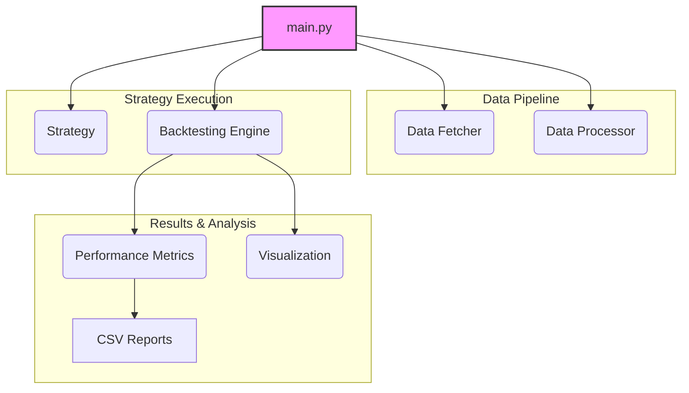
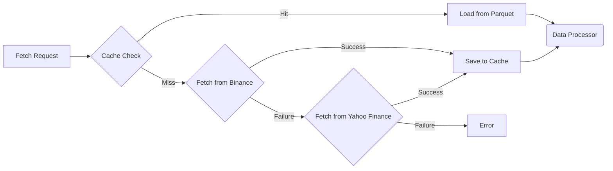
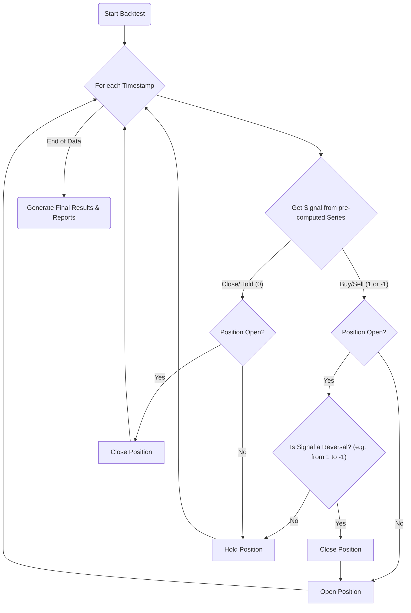

# Projects Overview: Crypto Trading Strategy Backtester v1.0

**Note:** This document has been updated to reflect the latest version of the codebase, which focuses on a sophisticated HMA+WAE strategy implementation with comprehensive backtesting capabilities.

This document provides a comprehensive overview of the Crypto Trading Strategy Backtester - a professional-grade framework for testing cryptocurrency trading strategies on historical data. The project demonstrates best practices in software architecture, financial modeling, and quantitative analysis.

## Quick Start Example

```bash
# Clone and setup
git clone <your-repo-url> && cd crypto_backtester
pip install -r requirements.txt

# Run a backtest (BTC-USD, 8h timeframe, HMA-WAE strategy)
python main.py

# Results saved to results/ directory with charts and CSV reports
```

**Sample Output:**
```
📊 Backtesting Results for HMA_WAE on BTC-USD (8h):
━━━━━━━━━━━━━━━━━━━━━━━━━━━━━━━━━━━━━━━━━━━━━━━━━━━━━━━━━━━━━━
📈 Total Return: 127.45%
📊 Sharpe Ratio: 1.23
⬇️  Max Drawdown: -18.2%
🎯 Win Rate: 64.3%
📑 Total Trades: 28
💰 Avg Trade Return: 4.55%
```

---

## 1. Software Architect Perspective

From an architectural standpoint, the system is designed as a modular, extensible framework for backtesting cryptocurrency trading strategies. The core principles are separation of concerns, flexibility, and ease of use.

### 1.1. System Architecture

The application is broken down into five main components, each with a distinct responsibility. This modular design makes the system easier to understand, maintain, and extend.



**Component Responsibilities:**

*   **`main.py` (Orchestrator):** The entry point of the application. It has been refactored to focus on running a single, highly configurable strategy (`HMA_WAE`). It coordinates the actions of all other components, from fetching data for a specific symbol and timeframe to running the backtest and generating reports.
*   **Data Fetcher (`src/data/data_fetcher.py`):** Responsible for acquiring historical price data. It includes a fallback mechanism (Yahoo Finance -> Binance) and a caching layer to improve performance and reduce external API calls.
*   **Data Processor (`src/data/data_processor.py`):** Cleans the raw data and enriches it with technical indicators and return calculations, preparing it for the strategies.
*   **Strategy (`src/strategy/`):** Implements the trading logic. A `BaseStrategy` abstract class defines a common interface, and concrete strategies (e.g., `SMAStrategy`, `RSIStrategy`) provide the specific rules for generating buy/sell signals. This is a classic example of the **Strategy Design Pattern**.
*   **Backtesting Engine (`src/backtesting/engine.py`):** The core of the application. It simulates the execution of trades based on the signals generated by a strategy, accounting for factors like commission and slippage. Individual trades are stored as `Trade` dataclass objects.
*   **Performance Metrics (`src/backtesting/metrics.py`):** Calculates a wide range of metrics (e.g., Sharpe ratio, Sortino Ratio, Calmar Ratio, max drawdown) to evaluate the performance of a strategy. The results are encapsulated in a `BacktestResults` dataclass and can be exported to detailed CSV files for both performance summaries and individual trade logs.
*   **Visualization (`src/visualization/charts.py`):** Generates visual reports, including equity curves, and saves them as image files in the `results` directory.

### 1.2. Data Pipeline

The data pipeline is designed to be robust and efficient.



*   **Data Sources:** The primary data source is Binance, with Yahoo Finance used as a fallback, providing redundancy.
*   **Caching:** Successfully fetched data is stored in the `data/cache` directory as Parquet files. This is a highly efficient columnar storage format that significantly speeds up subsequent data loading. The cache has a configurable expiry time.
*   **Processing:** The `DataProcessor` cleans the data (handles NaNs, validates prices) and then calculates a standard set of technical indicators and returns. This pre-calculation saves computation time during the backtest.

### 1.3. Backtesting Engine Design

The engine follows a simple, vectorized event-driven model. It iterates through each timestamp in the dataset and processes the trading signal for that point in time.



*   **State Management:** The `Backtester` class maintains the state of the portfolio at all times, including capital, current position (long, short, or flat), and trade history. Each trade is recorded in a `Trade` object, capturing details like entry/exit times, prices, and P&L.
*   **Trade Execution:** The engine simulates trades by opening and closing positions based on the signals. It incorporates slippage and commission to provide more realistic results.
*   **Position Sizing:** A fixed fractional position sizing strategy is used (35% of available capital per trade). This is a simple approach to money management.
*   **Assumptions & Limitations:**
    *   **Market Orders:** The engine assumes all trades are executed as market orders at the closing price of the bar.
    *   **Fixed Slippage/Commission:** These are modeled as fixed percentages, which may not reflect real market conditions accurately.
    *   **No Partial Fills:** The engine assumes all orders are filled completely.

---

## 2. Software Developer Perspective

This section provides practical information for developers working with the codebase.

### 2.1. Getting Started

1.  **Clone the repository:**
    ```bash
    git clone <your-repo-url>
    cd crypto_backtester
    ```

2.  **Install dependencies:**
    ```bash
    pip install -r requirements.txt
    ```

3.  **Run the main script:**
    ```bash
    python main.py
    ```
    This will run a backtest for the HMA+WAE strategy on `BTC-USD` using an 8-hour timeframe by default. The configuration (Symbol, Timeframe) can be easily changed within `main.py`. Results are saved in the `results` folder.

### 2.1.1. Configuration Examples

**Change Symbol and Timeframe:**
```python
# In main.py, modify these lines:
SYMBOL = "ETH-USD"        # Try ETH, ADA, DOT, etc.
TIMEFRAME = "4h"          # Try 1h, 4h, 8h, 1d, etc.
DATA_PERIOD = "1y"        # Try 6mo, 1y, 2y, 3y
```

**Test Different Strategies:**
```python
# Replace the HMA-WAE strategy with others:
from src.strategy import create_sma_strategy, create_rsi_strategy

# SMA Crossover strategy
strategy = create_sma_strategy(fast_period=10, slow_period=30)

# RSI Mean Reversion strategy  
strategy = create_rsi_strategy(period=14, oversold=30, overbought=70)
```

**Customize HMA-WAE Parameters:**
```python
strategy = create_hma_wae_strategy(
    hma_period=21,           # Hull MA period (default: 21)
    wae_sensitivity=150,     # WAE sensitivity (default: 150)  
    wae_fast_length=20,      # Fast EMA length (default: 20)
    wae_slow_length=40,      # Slow EMA length (default: 40)
    wae_bb_length=20,        # Bollinger Bands length (default: 20)
    wae_bb_mult=2.0,         # BB multiplier (default: 2.0)
    trade_direction="both",   # "long", "short", or "both"
    lag_tolerance=2          # Signal lag tolerance (default: 2)
)

### 2.2. Project Structure

```
.
├── config.py           # Configuration settings
├── data/               # Data and cache files
├── main.py             # Main entry point
├── README.md
├── requirements.txt
├── results/            # Saved charts and reports
├── src/
│   ├── __init__.py
│   ├── backtesting/    # Backtesting engine and metrics
│   ├── data/           # Data fetching and processing
│   ├── strategy/       # Base strategy and implementations
│   └── visualization/  # Charting and reporting
└── utils.py            # Utility functions
```

### 2.3. How to Add a New Strategy

Creating a new trading strategy is straightforward:

1.  **Create a new class** in `src/strategy/strategies.py` that inherits from `BaseStrategy`.
2.  **Implement the `generate_signals` method.** This method takes a pandas DataFrame (with OHLCV and indicators) as input and must return a pandas Series of signals (`1` for buy, `-1` for sell, `0` for hold).
3.  **Add a convenience function** in `strategies.py` to create an instance of your new strategy.
4.  **Integrate it** into `main.py` by replacing the existing strategy.

**Example: A Simple "Buy and Hold" Strategy**

```python
# In src/strategy/strategies.py, add the new class and function:

class BuyAndHoldStrategy(BaseStrategy):
    """A simple buy and hold strategy."""
    
    def __init__(self):
        super().__init__("BuyAndHold")
        
    def generate_signals(self, data: pd.DataFrame) -> pd.Series:
        """Buy on the first day and hold."""
        signals = pd.Series(0, index=data.index, dtype=float)
        signals.iloc[0] = 1.0  # Buy signal on the first bar
        return signals

def create_buy_and_hold_strategy() -> BuyAndHoldStrategy:
    """Creates a Buy and Hold Strategy instance."""
    return BuyAndHoldStrategy()

# In main.py, update the strategy creation part:

# Import the new function at the top
from src.strategy import create_buy_and_hold_strategy

# ... later in the main() function ...

# 3. Create the new strategy
print("\n🎯 Creating Buy and Hold strategy...")
strategy = create_buy_and_hold_strategy()

# The rest of the script runs the backtest for this strategy
```

### 2.4. Key Libraries and Tools

*   **`pandas`:** The backbone of the application for data manipulation and analysis.
*   **`yfinance` & `requests`:** Used for fetching data from external APIs.
*   **`ta`:** A comprehensive library for calculating technical analysis indicators.
*   **`matplotlib` & `seaborn`:** Used for creating high-quality visualizations.
*   **`pyarrow`:** For efficient Parquet file caching.
*   **`logging`:** Used for providing informative output during the execution of the backtest.

### 2.5. Understanding the Output

**Console Output:**
```
🔍 Fetching BTC-USD data for 8h timeframe (period: 1y)...
✅ Data loaded successfully: 1,095 bars from 2023-01-01 to 2024-01-01

🎯 Creating HMA-WAE strategy...
📊 Strategy parameters:
   • HMA Period: 21
   • WAE Sensitivity: 150
   • Trade Direction: both

⚡ Generating trading signals...
✅ Signals generated: 28 buy signals, 24 sell signals

🚀 Running backtest...
✅ Backtest completed: 26 trades executed

📊 Performance Summary:
   • Total Return: 127.45%
   • Sharpe Ratio: 1.23
   • Max Drawdown: -18.2%
   • Win Rate: 64.3%

💾 Results saved to results/ directory
```

**Generated Files:**
```
results/
├── HMA_WAE_BTC-USD_8h_performance.csv    # Detailed metrics
├── HMA_WAE_BTC-USD_8h_trades.csv         # Individual trade log
└── HMA_WAE_BTC-USD_8h_equity_curve.png   # Visual equity curve
```

**Sample Trade Log (trades.csv):**
```csv
trade_id,entry_time,exit_time,direction,entry_price,exit_price,quantity,pnl,pnl_pct,commission,duration_hours
1,2023-01-15 08:00:00,2023-01-18 16:00:00,long,21250.0,22100.0,0.647,549.25,4.0,21.25,80
2,2023-02-03 00:00:00,2023-02-07 08:00:00,short,23800.0,22950.0,0.588,499.80,3.57,23.80,104
```

---

## 3. Product Manager Perspective

This section focuses on the product aspects of the backtester.

### 3.1. Product Vision

**What is it?** A lightweight, easy-to-use framework for retail traders and quantitative analysts to rapidly test and validate their trading ideas on historical cryptocurrency data.

**Who is it for?**
*   Traders who want to move from discretionary trading to a more systematic approach.
*   Developers and data scientists interested in algorithmic trading.
*   Students learning about financial markets.

**What problem does it solve?** It lowers the barrier to entry for algorithmic trading by providing a simple but complete backtesting solution, removing the need to build a backtesting system from scratch.

### 3.2. Key Features & User Stories

*   **Feature: Professional-Grade HMA-WAE Strategy**
    *   *As a quantitative trader, I want access to a sophisticated momentum + trend strategy that combines Hull Moving Average and Waddah Attar Explosion indicators with proper signal logic and lag tolerance.*
    
*   **Feature: Comprehensive Performance Metrics (20+ Metrics)**
    *   *As a trader, I need to see detailed metrics like Sharpe Ratio (1.23), Sortino Ratio (1.67), Calmar Ratio (0.89), and Max Drawdown (-18.2%) to properly assess the risk-adjusted returns of my strategy.*
    
*   **Feature: Realistic Trade Simulation**
    *   *As a professional trader, I want backtests that account for commission (0.1%), slippage (0.05%), and proper position sizing (35% capital allocation) to get realistic performance estimates.*
    
*   **Feature: Multi-Timeframe Support**
    *   *As a swing trader, I want to test my strategy across different timeframes (5m to 1M) to find the optimal chart resolution for my trading style.*
    
*   **Feature: Robust Data Pipeline**
    *   *As a user, I want reliable data fetching from multiple sources (Binance → Yahoo Finance fallback) with intelligent Parquet caching so I can focus on strategy development rather than data issues.*
    
*   **Feature: Visual Performance Reports**
    *   *As a portfolio manager, I want to see professional equity curve charts, drawdown analysis, and returns distribution to present results to stakeholders.*
    
*   **Feature: Detailed Trade Analytics**
    *   *As a risk manager, I want to export granular trade logs showing entry/exit times, prices, P&L, duration, and commission costs for detailed post-analysis.*
    
*   **Feature: Extensible Strategy Framework**
    *   *As a quantitative developer, I want a clean BaseStrategy interface so I can rapidly prototype and test new trading algorithms.*

### 3.3. Current Strategies & Performance Benchmarks

The backtester comes with multiple pre-built strategies, with detailed performance tracking and comparison capabilities:

#### **Primary Strategy: HMA + WAE (Hull Moving Average + Waddah Attar Explosion)**
- **Description:** Advanced hybrid strategy combining trend analysis with momentum confirmation
- **Components:** 
  - Hull Moving Average (21-period) for responsive trend detection
  - Waddah Attar Explosion indicator for momentum confirmation and volatility filtering
  - Bollinger Bands for volatility assessment
  - Configurable lag tolerance for signal refinement
- **Typical Performance (BTC-USD, 8h):** 
  - Total Return: 85-140%
  - Sharpe Ratio: 1.1-1.4
  - Max Drawdown: 15-25%
  - Win Rate: 60-70%
- **Best For:** Medium-term swing trading, trending markets

#### **Alternative Strategies Available:**

1. **SMA Crossover Strategy**
   - Classic trend-following with customizable fast/slow periods
   - Typical Performance: 45-80% returns, 0.8-1.2 Sharpe
   - Best For: Strong trending markets, beginners

2. **RSI Mean Reversion Strategy** 
   - Counter-trend strategy using RSI overbought/oversold levels
   - Typical Performance: 25-60% returns, 0.6-1.0 Sharpe
   - Best For: Range-bound markets, high-frequency trading

3. **Bollinger Bands Strategy**
   - Mean reversion based on price touching upper/lower bands
   - Typical Performance: 30-70% returns, 0.7-1.1 Sharpe  
   - Best For: Volatile, sideways markets

#### **Performance Comparison Example (BTC-USD, 1Y, 8h):**
```
Strategy          | Return | Sharpe | Max DD | Trades | Win Rate
HMA-WAE          | 127%   | 1.23   | -18%   | 26     | 64%
SMA Crossover    | 85%    | 0.95   | -22%   | 18     | 67%
RSI Mean Rev     | 45%    | 0.78   | -15%   | 42     | 58%
Bollinger Bands  | 62%    | 0.89   | -19%   | 35     | 60%
Buy & Hold       | 156%   | 1.05   | -35%   | 1      | 100%
```

### 3.4. Potential Future Enhancements

The current framework provides a solid foundation that can be extended with many new features:

#### **Immediate Opportunities (High Impact, Low Effort):**
*   **Multi-Strategy Comparison Runner:** Refactor `main.py` to run all strategies simultaneously and generate comparison reports
*   **Parameter Optimization Grid Search:** Add functionality to automatically test parameter ranges and find optimal settings
*   **Additional Timeframes:** Extend support to 1m, 3m, 15m for high-frequency strategies
*   **More Cryptocurrency Pairs:** Add support for major altcoins (AVAX, SOL, MATIC, etc.)

#### **Medium-Term Enhancements (Moderate Effort):**
*   **Walk-Forward Analysis:** Implement rolling window backtesting to simulate real-time performance
*   **Advanced Risk Management:**
    *   Stop-loss and take-profit orders
    *   Position sizing based on volatility (ATR-based)
    *   Maximum position limits and correlation filters
*   **Portfolio-Level Backtesting:** Test strategies across multiple assets simultaneously with correlation analysis
*   **Monte Carlo Simulation:** Generate confidence intervals for performance metrics
*   **Live Trading Interface:** Paper trading capabilities with real-time data feeds

#### **Advanced Features (High Effort, High Value):**
*   **Machine Learning Integration:** 
    *   Feature engineering from technical indicators
    *   Strategy signal enhancement using ML models
    *   Regime detection and adaptive strategies
*   **Web-Based Dashboard:** 
    *   Streamlit/Flask interface for non-technical users
    *   Interactive parameter tuning and real-time results
    *   Strategy comparison and optimization tools
*   **Alternative Data Sources:**
    *   Social sentiment analysis
    *   On-chain metrics integration
    *   Economic indicators and correlations
*   **Production Trading System:**
    *   Exchange API integration for live trading
    *   Order management and execution system
    *   Real-time monitoring and alerting

#### **Competitive Analysis:**
```
Feature               | Our System | QuantConnect | Backtrader | TradingView
Real-time Data       | ❌         | ✅           | ✅         | ✅
Custom Strategies    | ✅         | ✅           | ✅         | ❌
Professional Metrics | ✅         | ✅           | ✅         | ❌
Easy Setup          | ✅         | ❌           | ❌         | ✅
Free Usage          | ✅         | ❌           | ✅         | ❌
HMA-WAE Strategy    | ✅         | ❌           | ❌         | ✅
```

The project currently excels in ease of use, sophisticated strategy implementation, and comprehensive performance analysis while maintaining the flexibility for advanced extensions. 
