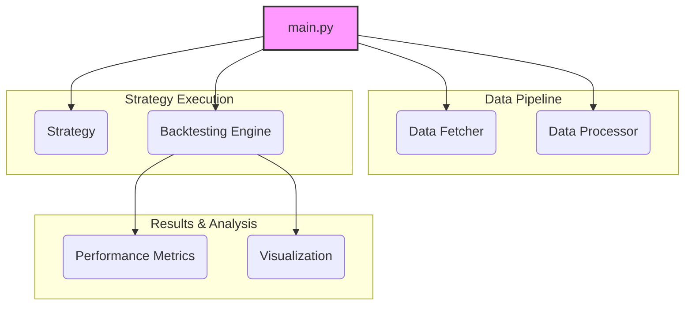
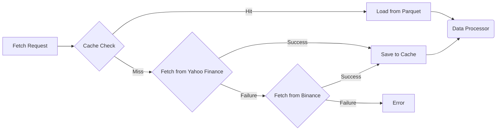
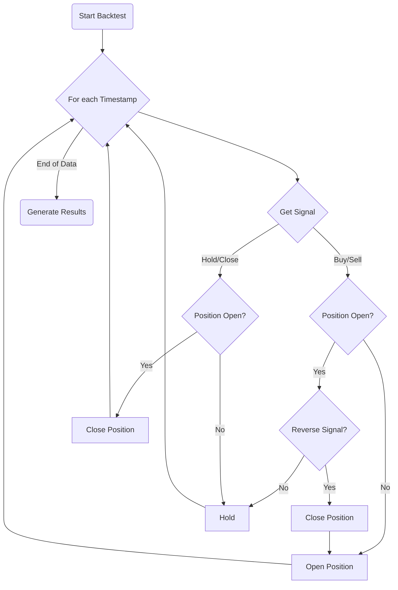

# Project Overview: Crypto Trading Strategy Backtester v1.0

This document provides a comprehensive overview of the Crypto Trading Strategy Backtester, analyzed from the perspectives of a Software Architect, a Software Developer, and a Product Manager.

---

## 1. Software Architect Perspective

From an architectural standpoint, the system is designed as a modular, extensible framework for backtesting cryptocurrency trading strategies. The core principles are separation of concerns, flexibility, and ease of use.

### 1.1. System Architecture

The application is broken down into five main components, each with a distinct responsibility. This modular design makes the system easier to understand, maintain, and extend.



**Component Responsibilities:**

*   **`main.py` (Orchestrator):** The entry point of the application. It coordinates the actions of all other components, from fetching data to running backtests and generating reports.
*   **Data Fetcher (`src/data/data_fetcher.py`):** Responsible for acquiring historical price data. It includes a fallback mechanism (Yahoo Finance -> Binance) and a caching layer to improve performance and reduce external API calls.
*   **Data Processor (`src/data/data_processor.py`):** Cleans the raw data and enriches it with technical indicators and return calculations, preparing it for the strategies.
*   **Strategy (`src/strategy/`):** Implements the trading logic. A `BaseStrategy` abstract class defines a common interface, and concrete strategies (e.g., `SMAStrategy`, `RSIStrategy`) provide the specific rules for generating buy/sell signals. This is a classic example of the **Strategy Design Pattern**.
*   **Backtesting Engine (`src/backtesting/engine.py`):** The core of the application. It simulates the execution of trades based on the signals generated by a strategy, accounting for factors like commission and slippage.
*   **Performance Metrics (`src/backtesting/metrics.py`):** Calculates a wide range of metrics (e.g., Sharpe ratio, max drawdown) to evaluate the performance of a strategy. The results are encapsulated in a `BacktestResults` dataclass, a form of **Data Transfer Object (DTO)**.
*   **Visualization (`src/visualization/charts.py`):** Generates visual reports, including equity curves and performance heatmaps, to make the backtest results easy to interpret.

### 1.2. Data Pipeline

The data pipeline is designed to be robust and efficient.



*   **Data Sources:** The primary source is Yahoo Finance, with Binance as a fallback, providing redundancy.
*   **Caching:** Successfully fetched data is stored in the `data/cache` directory as Parquet files. This is a highly efficient columnar storage format that significantly speeds up subsequent data loading. The cache has a configurable expiry time.
*   **Processing:** The `DataProcessor` cleans the data (handles NaNs, validates prices) and then calculates a standard set of technical indicators and returns. This pre-calculation saves computation time during the backtest.

### 1.3. Backtesting Engine Design

The engine follows a simple, vectorized event-driven model. It iterates through each timestamp in the dataset and processes the trading signal for that point in time.



*   **State Management:** The `Backtester` class maintains the state of the portfolio at all times, including capital, current position (long, short, or flat), and trade history.
*   **Trade Execution:** The engine simulates trades by opening and closing positions based on the signals. It incorporates slippage and commission to provide more realistic results.
*   **Position Sizing:** A fixed fractional position sizing strategy is used (35% of available capital per trade). This is a simple approach to money management.
*   **Assumptions & Limitations:**
    *   **Market Orders:** The engine assumes all trades are executed as market orders at the closing price of the bar.
    *   **Fixed Slippage/Commission:** These are modeled as fixed percentages, which may not reflect real market conditions accurately.
    *   **No Partial Fills:** The engine assumes all orders are filled completely.

---

## 2. Software Developer Perspective

This section provides practical information for developers working with the codebase.

### 2.1. Getting Started

1.  **Clone the repository:**
    ```bash
    git clone <your-repo-url>
    cd crypto_backtester
    ```

2.  **Install dependencies:**
    ```bash
    pip install -r requirements.txt
    ```

3.  **Run the main script:**
    ```bash
    python main.py
    ```
    This will run the default backtest (BTC-USD, 1-year data) for the SMA and RSI strategies and save the results in the `results` folder.

### 2.2. Project Structure

```
.
├── config.py           # Configuration settings
├── data/               # Data and cache files
├── main.py             # Main entry point
├── README.md
├── requirements.txt
├── results/            # Saved charts and reports
├── src/
│   ├── __init__.py
│   ├── backtesting/    # Backtesting engine and metrics
│   ├── data/           # Data fetching and processing
│   ├── strategy/       # Base strategy and implementations
│   └── visualization/  # Charting and reporting
└── utils.py            # Utility functions
```

### 2.3. How to Add a New Strategy

Creating a new trading strategy is straightforward:

1.  **Create a new class** in `src/strategy/strategies.py` that inherits from `BaseStrategy`.
2.  **Implement the `generate_signals` method.** This method takes a pandas DataFrame (with OHLCV and indicators) as input and must return a pandas Series of signals (`1` for buy, `-1` for sell, `0` for hold).
3.  **(Optional)** Add a convenience function to create an instance of your new strategy.
4.  **Integrate it** into `main.py` to test it.

**Example: A Simple "Buy and Hold" Strategy**

```python
# In src/strategy/strategies.py

class BuyAndHoldStrategy(BaseStrategy):
    """A simple buy and hold strategy."""
    
    def __init__(self):
        super().__init__("BuyAndHold")
        
    def generate_signals(self, data: pd.DataFrame) -> pd.Series:
        """Buy on the first day and hold."""
        signals = pd.Series(0, index=data.index, dtype=float)
        signals.iloc[0] = 1.0  # Buy signal on the first bar
        return signals

# In main.py, add it to the strategies dictionary
strategies = {
    'SMA_20_50': create_sma_strategy(20, 50),
    'RSI_14': create_rsi_strategy(14, 30, 70),
    'BuyAndHold': BuyAndHoldStrategy()  # Add the new strategy
}
```

### 2.4. Key Libraries and Tools

*   **`pandas`:** The backbone of the application for data manipulation and analysis.
*   **`yfinance` & `requests`:** Used for fetching data from external APIs.
*   **`ta`:** A comprehensive library for calculating technical analysis indicators.
*   **`matplotlib` & `seaborn`:** Used for creating high-quality visualizations.
*   **`logging`:** Used for providing informative output during the execution of the backtest.

---

## 3. Product Manager Perspective

This section focuses on the product aspects of the backtester.

### 3.1. Product Vision

**What is it?** A lightweight, easy-to-use framework for retail traders and quantitative analysts to rapidly test and validate their trading ideas on historical cryptocurrency data.

**Who is it for?**
*   Traders who want to move from discretionary trading to a more systematic approach.
*   Developers and data scientists interested in algorithmic trading.
*   Students learning about financial markets.

**What problem does it solve?** It lowers the barrier to entry for algorithmic trading by providing a simple but complete backtesting solution, removing the need to build a backtesting system from scratch.

### 3.2. Key Features & User Stories

*   **Feature: Multi-Strategy Backtesting**
    *   *As a user, I want to test multiple strategies at once so that I can compare their performance side-by-side.*
*   **Feature: Comprehensive Performance Metrics**
    *   *As a trader, I need to see detailed metrics like Sharpe Ratio and Max Drawdown to properly assess the risk and return of my strategy.*
*   **Feature: Visual Performance Reports**
    *   *As a user, I want to see an equity curve chart so I can visually understand how my strategy's value changes over time.*
*   **Feature: Extensible Strategy Framework**
    *   *As a developer, I want a simple way to add my own custom strategies so I can test my unique trading ideas.*
*   **Feature: Data Caching**
    *   *As a user, I want the application to run quickly on subsequent launches so I can iterate on my ideas faster.*

### 3.3. Current Strategies

The backtester comes with four pre-built strategies:
1.  **SMA Crossover:** A classic trend-following strategy that buys when a fast-moving average crosses above a slow one.
2.  **RSI Mean Reversion:** A strategy that buys when an asset is "oversold" and sells when it's "overbought," based on the RSI indicator.
3.  **Bollinger Bands:** Another mean-reversion strategy that trades based on the price touching the upper or lower bands.
4.  **HMA + WAE:** A more advanced strategy that uses a fast-reacting moving average (HMA) and a momentum filter to find entry points.

### 3.4. Potential Future Enhancements

The current framework provides a solid foundation that can be extended with many new features:

*   **Parameter Optimization:** Add functionality to automatically test a range of strategy parameters (e.g., different SMA periods) to find the optimal settings.
*   **Walk-Forward Analysis:** Implement a more robust testing method that simulates how a strategy would perform in real-time.
*   **Support for More Assets:** Extend the data fetcher to support other asset classes like stocks, forex, or futures.
*   **Advanced Risk Management:**
    *   Implement stop-loss and take-profit orders.
    *   Introduce more dynamic position sizing models (e.g., based on volatility).
*   **Portfolio-Level Backtesting:** Allow testing of strategies across a portfolio of multiple assets simultaneously.
*   **Web-Based User Interface:** Create a simple web app (using Flask or Streamlit) to allow users to run backtests and view results without interacting with the code directly. 